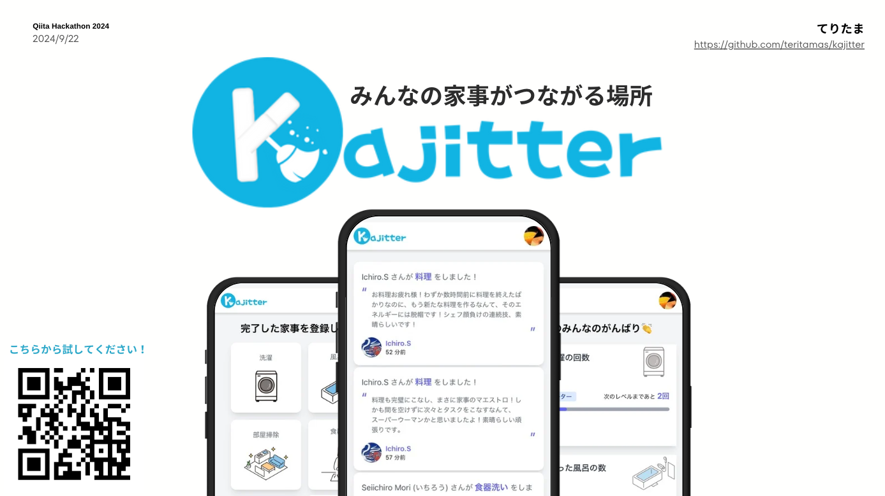
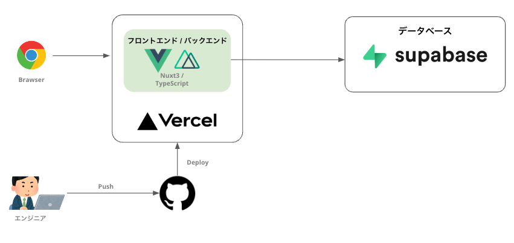

# Kajitter

[デモページ](https://kajitter.vercel.app/)

以下の QR コードからもアクセスできます。本アプリケーションはスマートフォンでの利用を推奨しています。


## 概要

Kajitter は家事を世界にオープンにし、みんなで家事をするモチベーションを高め合う SNS です。

プレゼン資料はこちら
[](https://www.canva.com/design/DAGRbp6qSv8/ovuKglgZuEpe9BNKSTPtIw/view?utm_content=DAGRbp6qSv8&utm_campaign=designshare&utm_medium=link&utm_source=editor)

## 全体構成

本アプリケーションは Vercel にデプロイされており、データベース/認証には Supabase を使用しています。

全体構成は以下の通りです。


### 技術スタック

| 技術     | 利用用途                         | URL                              |
| -------- | -------------------------------- | -------------------------------- |
| Nuxt.js  | フロント/バックエンド            | [Nuxt.js](https://nuxtjs.org/)   |
| Vercel   | サーバーのホスティング           | [Vercel](https://vercel.com/)    |
| Supabase | データベースの永続化とユーザ認証 | [Supabase](https://supabase.io/) |
| Open AI  | 家事の応援コメントを生成         | [Open AI](https://openai.com/)   |

## Quick Start

必要ライブラリをインストールします。

```bash
npm install
```

その後、以下のコマンドを実行することで、開発サーバーが立ち上がります。

```bash
npm run dev
```

開発サーバは 以下の URL からアクセスできます。

- http://localhost:3000

## 開発者向け

### DB の操作

DB は Supabase を使用しています。DB の操作を行うために、Supabase にログインし、プロジェクトを紐づける必要があります。

```bash
npx supabase login
supabase link
# アカウントに紐づいたプロジェクトが表示されるので、該当のプロジェクトを選択して紐づける
```

#### Supabase から DB のスキーマをエクスポート

Supabase からスキーマをエクスポートし、`types/schema.ts` に保存する。

```bash
supabase gen types typescript --linked > ./types/schema.ts
```

#### Trigger の設定

ユーザ新規作成後、`profiles` テーブルに新規レコードを追加するための Trigger を設定する必要がある。

SQL は以下 SQL を実行する

- [`sql/trigger.sql`](sql/trigger.sql)

### デプロイ

本アプリケーションは以下のリポジトリと Sync した後 Vercel にデプロイされます。

- https://github.com/sey323/kajitter
